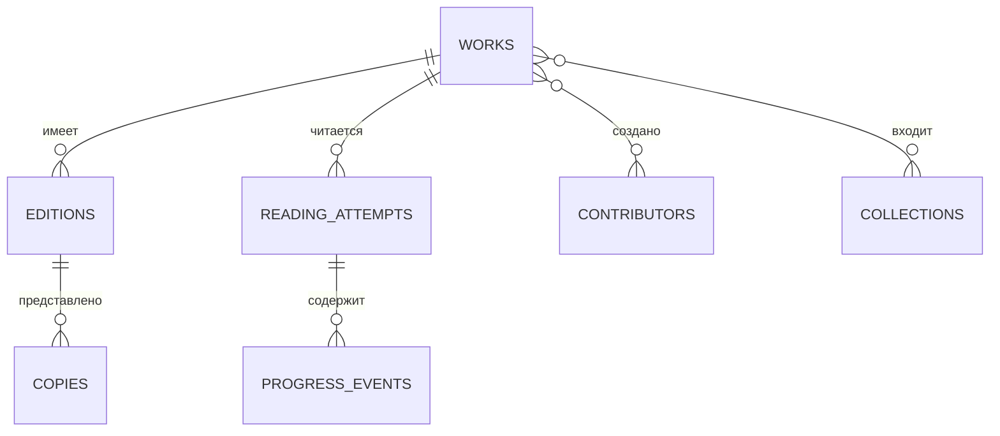

# Vlada Books

Персональная информационная библиотека: каталог физических книг, история чтения и аналитика коллекции. Это не читалка — приложение хранит сведения о произведениях, конкретных изданиях и домашних экземплярах.

## Что уже работает

- импортированы 246 строк исходной картотеки: 235 произведений, 246 изданий и 246 экземпляров;
- главная панель, каталог с поиском и фильтрами, сеточный и табличный режимы;
- карточка книги со статусом, прогрессом, оценкой и заметками;
- добавление книги вручную или с поиском метаданных Open Library;
- аналитика жанров, издательств, статусов чтения и качества данных;
- тематические подборки и JSON-экспорт;
- загрузка собственных обложек в R2 через API;
- PWA-режим и базовый офлайн-кэш;
- адаптивный интерфейс с мобильной нижней навигацией.

## Модель данных



Разделение принципиально: «Анна Каренина» — произведение, издание конкретного года — edition, а физическая книга на полке — copy. Поэтому повторные издания не искажают статистику прочитанного.

## Стек

- React 19 + TypeScript + Vinext;
- Cloudflare Workers;
- D1 + Drizzle ORM для структурированных данных;
- R2 для пользовательских обложек;
- Tailwind CSS 4 как build-time CSS engine, интерфейс оформлен собственным дизайн-слоем.

## Локальный запуск

Требуется Node.js `>=22.13.0`.

```bash
npm ci
npm run dev
```

Полезные команды:

```bash
npm run lint
npm test
npm run db:generate
npm run build
```

## Импорт картотеки

Нормализованный seed находится в `app/data/catalog-seed.json`. Повторно собрать его из Excel можно скриптом `scripts/generate-catalog-seed.mjs`; путь к исходному `.xlsx` передаётся первым аргументом. При первом обращении к API seed автоматически и пакетно переносится в D1.

## API

| Маршрут | Назначение |
|---|---|
| `GET /api/catalog` | Полный каталог и агрегаты |
| `POST /api/books` | Добавление произведения, издания и экземпляра |
| `PATCH /api/reading/:workId` | Статус, прогресс, оценка и заметки |
| `GET /api/search?q=` | Поиск метаданных Open Library |
| `POST /api/covers` | Загрузка изображения в R2 |
| `GET /api/covers/:key` | Отдача обложки с кэшированием |

## Ближайшее развитие

- реальное создание и редактирование пользовательских подборок;
- сканирование ISBN камерой телефона;
- расширенная временная аналитика после накопления истории чтения;
- дедупликация и полуавтоматическое дополнение 35 карточек без автора;
- резервные копии и обратный импорт JSON.
